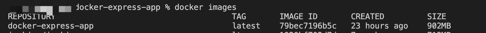
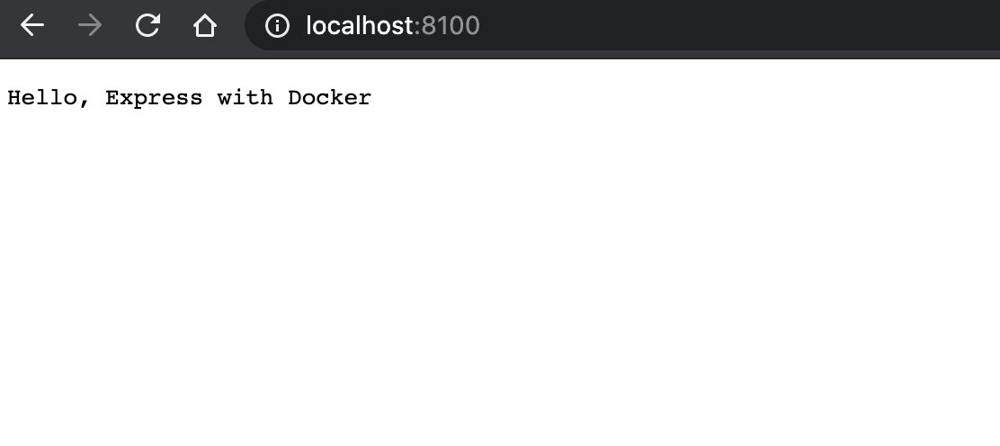

# Docker 镜像构建

> 使用`expess`项目为构建模板

## 作用

统一环境，对同一个项目部署环境一致

## 创建 docker 镜像

1. 创建`express`服务

```sh
mkdir express-app && cd express-app
touch index.js
```

在`index.js`中初始化如下服务：

```js
const express = require('express')
cosnt app = express()

app.get('/', function (req, res) {
 res.send('Hello Express with Docker!')
})

// 让服务器监听 9000 端口
app.listen(9000, function () {
  console.log('app listening on port 9000!')
})
```

使用`npm init -y`初始化`package.json`,并安装`express`依赖`npm install express`,`package.json`内容如下：

```json
{
  "name": "express-app",
  "version": "1.0.0",
  "description": "Dockerized node.js app",
  "main": "index.js",
  "author": "",
  "license": "ISC",
  "dependencies": {
    "express": "^4.16.4"
  }
}
```

2. 创建 Docker 配置文件

首先，在项目根目录新建`.dockerignore`文件，并初始化内容：

```
.git
node_modules
npm*.log
```

`.dockerignore`文件类似`.gitignore`，表示项目中路径文件要排除，不打包进 image 文件。如果没有需要排除的文件，可以不用新建这个文件。

然后，在项目根目录创建`Dockerfile`配置文件，并按如下代码初始化：

```sh
# Dockerfile
# 运行环境，当前image继承官方node image，冒号表示标签，即版本为10的node
FROM node:10
# 工作目录
WORKDIR /app
# 复制源码到image的工作目录
COPY . /app
# A.安装yarn
RUN curl -o- -L https://yarnpkg.com/install.sh | bash
# B.查看yarn是否安装成功，可删掉
RUN yarn -v
# C.安装依赖，安装后所有依赖都将打包进image文件
RUN yarn install
# 将容器 9000 端口暴露出来， 允许外部连接这个端口。导出端口和服务启动端口一致
EXPOSE 9000
# 启动命令，可使用CMD ['node', 'index.js']
CMD node index.js
```

以上使用`yarn`包管理工具，可以直接使用`RUN npm install --registry=https://registry.npm.taobao.org`替换`A、B、C`三步

`RUN`命令在 image 文件的构建阶段执行，执行结果都会打包进入 image 文件；`CMD`命令则是在容器启动后执行。一个 Dockerfile 可以包含多个 RUN 命令，但是只能有一个 CMD 命令。

_注意，指定了 `CMD` 命令以后，`docker container run` 命令就不能附加命令了（比如`/bin/bash`），否则它会覆盖 `CMD` 命令。_

3. 构建 docker 镜像

在项目根目录执行：

```sh
#  Build a image： docker build -t <image-name> <relative-path-to-your-dockerfile>
docker build -t express-app .
# 或
docker image build -t express-app:0.0.1 .
```

以上命令表示在宿主机创建一个名为`express-app`的镜像，`-t`用来指定镜像名称，后面还可以用冒号指定标签。如果不指定标签就是默认 latest。最后的那个点`.`表示 Dockerfile 文件所在的路径,上例是当前目录，所以是一个点。

如果运行成功，可以运行`docker images`查看新生成 iamge 文件`express-app`，如下图


4. 运行 docker 容器

```
# Run docker
docker run -p 8100:9000 express-app
# 或者
docker container run -p 8100:9000 -it express-app:0.0.1
```

这条命令用来创建并运行一个`docker`容器，`-p 8100:9000`是一个发布（`publish`）标识，它将本机的`8100` 端口映射到了容器中的`9000`端口。现在所有对本机`8100`端口的访问，都会被容器中的`9000`端口监听。`-it`表示容器的 Shell 映射到本机的 Shell，然后你在本机窗口输入的命令，就会传入容器；`express-app`就是刚创建的镜像名称。

运行成功后，在浏览器打开`localhost:8100`后，可以看到`Hello Express with Docker`


## 上传镜像到阿里云

1. 开通阿里云镜像仓库并设置仓库密码
2. 创建镜像仓库[resp]和命名空间[namespace]
3. `docker`登录

```shell
sudo docker login -u [username] -p [password] registry.cn-shenzhen.aliyuncs.com
```

_输入密码为系统操作密码_

4. 上传镜像到镜像仓库

```shell
# 参看镜像
docker images
# 重命名镜像
sudo docker tag [imageId] registry.cn-shenzhen.aliyuncs.com/[namespace]/[resp]:[TAG]
# 推送镜像至Registry
sudo docker push registry.cn-shenzhen.aliyuncs.com/sunyxq/fly:[TAG]
```

`imageId`为镜像`id`，`TAG`为**镜像版本号**，参数可以通过`docker images`查看。`namespace`为阿里云镜像仓库的命名空间；[resp]为阿里云镜像仓库名称。前面的准备工作都可以获取到相关信息。

5. 拉取镜像

```
sudo docker pull registry.cn-shenzhen.aliyuncs.com/sunyxq/fly:[TAG]
```

## 参考

1. [当 Node.js 遇见 Docker](https://blog.fundebug.com/2017/03/27/nodejs-docker/)
2. [写给前端工程师的 Docker 入门](https://segmentfault.com/a/1190000019898011)
3. [docker 系列之入门篇](https://www.jianshu.com/p/a5ea2ff60594)
4. [Docker 在前端开发环境中的应用](https://zhuanlan.zhihu.com/p/33365859)
5. [使用 Docker 打造超溜的前端环境](https://github.com/axetroy/blog/issues/178)
6. [从零开始 Docker 化你的 Node.js 应用](https://juejin.im/post/5b2cb6986fb9a00e3a5aa279)
