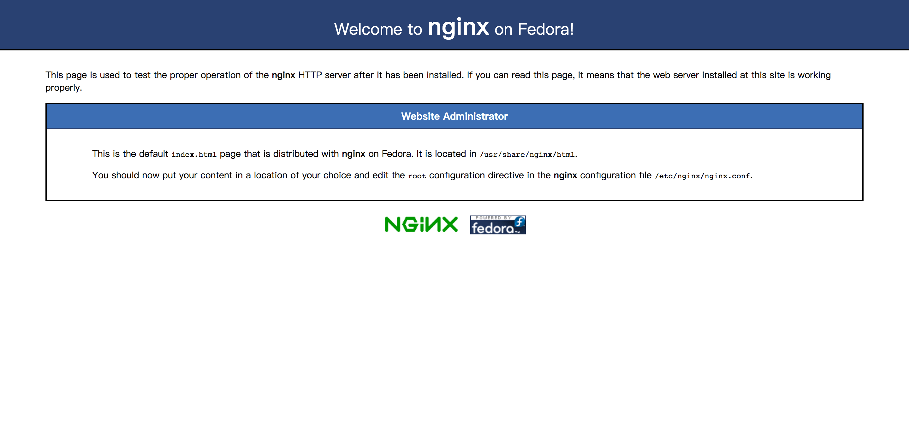

# CentOS 环境配置

> CentOS 环境配置一般用于服务器环境搭建，这里记录一些常用的环境配置

## CentOS 安装配置 git

1. 安装 git

```sh
yum install git
```

2. 验证安装

```sh
git version
```

3. git 配置基本信息

```sh
# 配置基本信息
git config --global user.name 'sunyxq'
git config --global user.email 'sunyxq@qq.com'

# 查看配置信息
git config -l
```

## CentOS 安装 Nginx

1. 配置 EPEL 源

```sh
sudo yum install -y epel-release
sudo yum -y update
```

2. 安装 Nginx

```sh
yum install nginx
```

安装成功后，默认的网站目录为： `/usr/share/nginx/html`;
默认的配置文件为：`/etc/nginx/nginx.conf`
自定义配置文件目录为: `/etc/nginx/conf.d/`

3. 启动 nginx

```sh
systemctl start nginx
```

启动成功后，在浏览器可看到默认首页


### 操作 Nginx

- 启动 Nginx

```sh
systemctl start nginx
```

- 停止 Nginx

```sh
systemctl stop nginx
```

- 重启 Nginx

```sh
systemctl restart nginx
```

- 查看 Nginx 状态

```sh
systemctl status nginx
```

- 开机自启动 Nginx

```sh
systemctl enable nginx
```

- 禁用开机启动 Nginx

```sh
systemctl disable nginx
```

## CentOS 安装 nodejs

> CentOS 下有多种安装 nodejs 方法

- 从 EPEL 源安装 nodejs**(推荐此方法)**

```sh
# 安装
sudo yum install epel-release
yun install nodejs
# 验证
node -v
npm -v
```

- 使用已编译压缩包安装

1. 下载 nodejs 包

```sh
cd ~
wget http://nodejs.org/dist/v10.15.0/node-v10.15.0-linux-x64.tar.gz
```

2. 解压

```sh
sudo tar --strip-components 1 -xzvf node-v* -C /usr/local
```

3. 验证安装

```sh
node -v
npm -v
```

- 源码编译安装

1. 下载 nodejs 源码

```sh
wget https://nodejs.org/dist/v10.15.0/node-v10.15.0.tar.gz
```

2. 解压

```sh
tar zxvf node-v10.15.0.tar.gz
```

3. 配置

```sh
cd node-v10.15.0
./configure
```

4. 编译安装

```sh
# 编译
make
# 安装
sudo make install
```

5. 验证安装

```
node -v
npm -v
```

## 参考链接

1. [Centos 7 下安装配置 Nginx](https://developer.aliyun.com/article/699966)
2. [在 CentOS 7 上安装 Node.js 的 4 种方法（yum 安装和源码安装）](https://www.cnblogs.com/fps2tao/p/9956139.html)
3. [如何在 CentOS 安装 node.js](https://blog.csdn.net/lu_embedded/article/details/79138650)
