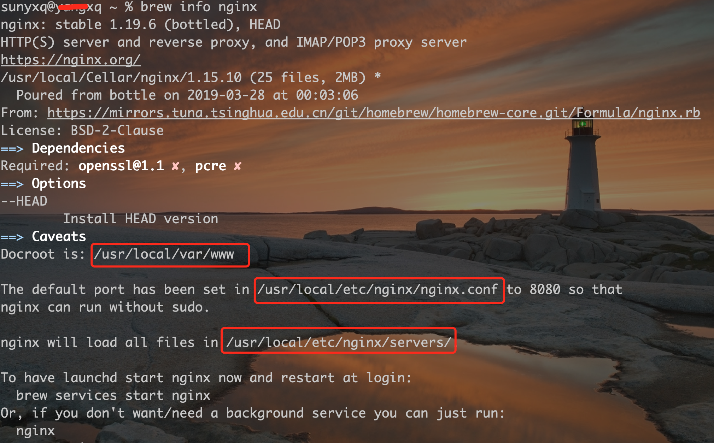
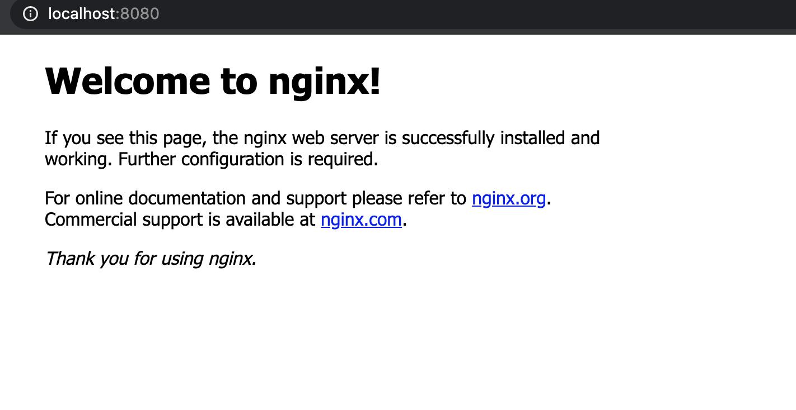
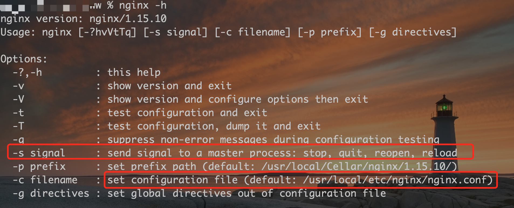

# Nginx 入门

## 安装`Nginx`

> Mac 下使用`Homebrew`安装

1. 搜索`nginx`

```sh
brew search nginx
```


2. 查看`nginx`信息

```sh
brew info nginx
```



3. 安装`nginx`

```sh
brew install nginx
```

安装完成后，主页的文件放在`/usr/local/var/www`；
默认配置文件在`/usr/local/etc/nginx/nginx.conf`

4. 运行`ngxin`

```sh
nginx
```

`nginx`默认使用`8080`端口，在浏览器直接访问`localhost:8080`看到如下内容表示 nginx 启动成功


## `Nginx`常用命令

- 启动`Nginx`

```sh
nginx
```

- 查看`Nginx`是否运行

```sh
ps -A | grep nginx
```

- 停止`Nginx`

```sh
nginx -s stop
```

- 重启`Nginx`

```sh
nginx -s reload
```

每次更改完配置文件`nginx.conf`后，需重启`nginx`才能生效

- 查看 Nginx 版本号

```
nginx -v
```

- 查看全部帮助信息

```
nginx -h
```

全部信息里可以看到以上全部`nginx`命令参数，如**停止**、**重启**、默认配置文件路径。。。


## 参考链接

1. [MAC 下安装 nginx](https://segmentfault.com/a/1190000016020328)
2. [nginx 安装及其配置详细教程](https://zhuanlan.zhihu.com/p/83890573)
3. [Mac OS 系统下，Nginx 的配置和常用命令](https://www.jianshu.com/p/05900b778395)
